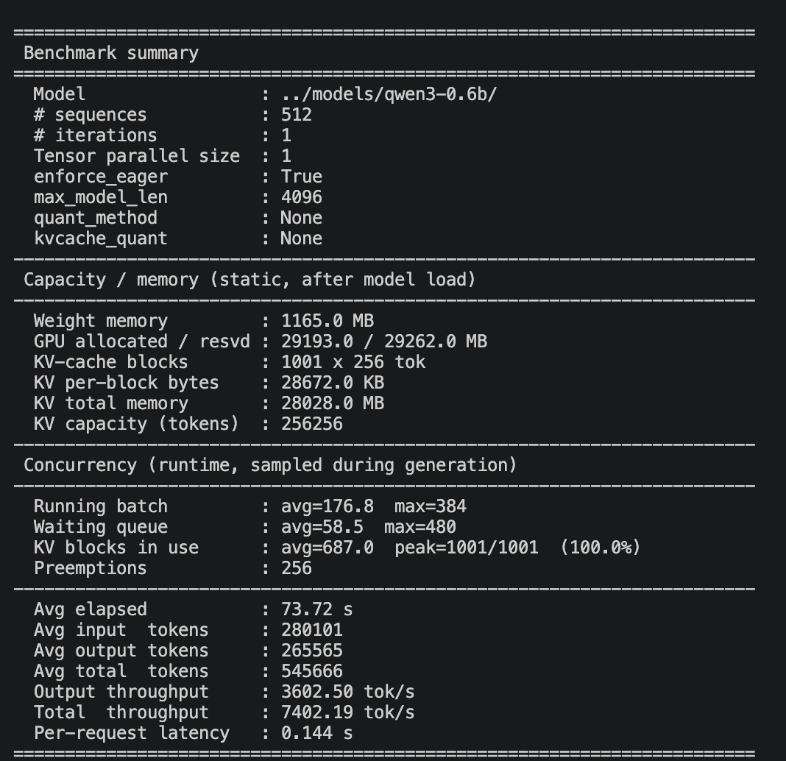
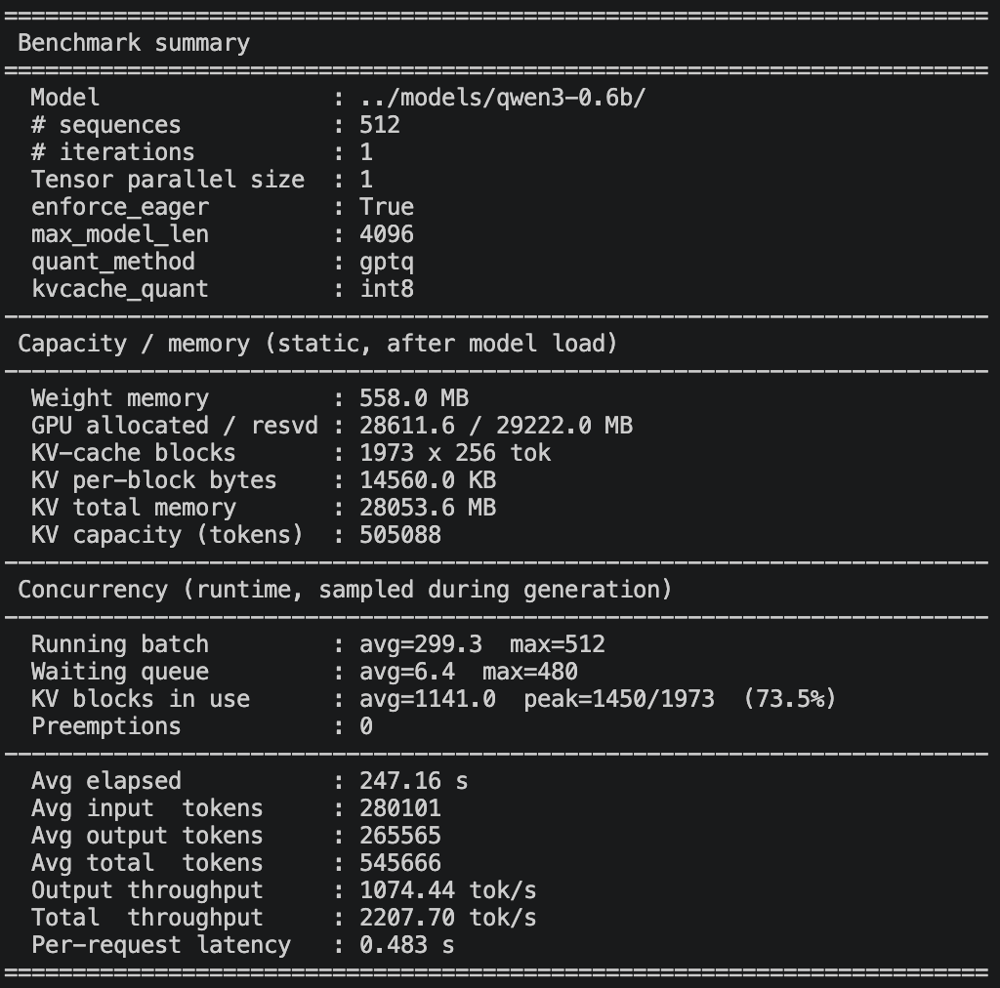

# Multiple models adapted for nano-vllm
## 🪄 Features:
- Multiple Models Adapt: [Llama2](https://huggingface.co/meta-llama/Llama-2-7b), [Qwen2](https://huggingface.co/Qwen/Qwen2.5-7B-Instruct), [Qwen3](https://huggingface.co/Qwen/Qwen3-0.6B), [Qwen3MOE](https://huggingface.co/Qwen/Qwen3-30B-A3B)
- Cuda Kernels Rebuild: activation.cu, embedding.cu, layernorm.cu, linear.cu, rotary_embedding.cu
- Tensor Parallel Fit: Achieve the ***TP***, so you can use this project to infer your model in multiple GPUs
- Inherit vLLM Features: PageAttention, Continuous Batching, Chunked Prefill, Prefix Caching...
- Quantization: GPTQ for `weight`, Int8 for `kvcache`. You can check the performence with `quant` or not in [Quantization Performance](#-quantization-performance).
## 🪜 Structure
tiny-vllm 作为 vllm 轻量化学习型项目，代码结构精简且聚焦 LLM 推理核心链路，整体目录组织如下：

```plaintext
tiny-vllm/
├── nanovllm/                # 核心轻量化LLM推理模块（基于vllm核心逻辑拆解+轻量化改造）
│   ├── engine               # 推理框架核心引擎，包括pageattn等
│   ├── layers               # 模型的核心部分，包括pytorch实现层和cuda实现的部分算子
│   ├── models               # 不同的模型的适配
│   ├── __init__.py          # 初始化文件
│   ├── config.py            # 配置文件
│   ├── llm.py               # LLM接口
│   ├── sampling_params.py   # 采样参数
│   ├── model_executor.py    # 模型推理执行核心（封装前向计算、张量处理、设备适配逻辑）
│   └── utils                # 工具
├── example.py               # 功能验证示例（单卡推理/对话交互演示，验证核心模块可用性）
├── requirements.txt         # 项目依赖清单（torch/transformers等，适配轻量化部署）
└── README.md                # 项目说明文档（背景、代码结构、运行步骤、核心实现说明）

```
## ⚒️ Requirements
 - Python 3.8+
 - CUDA 11.0+
 - Pytorch 2.1.0
 - Transformer
 - Flash Attention


## 📊 Quantization Performance

The benchmark script [`benckmark/bench.py`](./benckmark/bench.py) reports both
throughput and *capacity / concurrency* metrics so the memory benefit of
quantization is directly visible:

- `weight_MB` — resident GPU memory for model weights
- `num_kvcache_blocks` / `kv_capacity_tokens` — paged-attention capacity
- `avg_running_batch` / `max_running_batch` — actual runtime concurrency
- `num_preemptions` — how many times the scheduler had to evict a running
  sequence because KV blocks ran out

### Example1: `num_seqs=16` in Qwen3-0.6B on A100-40GB (gpu-memory-utilization=0.5)

| Metric | Baseline (FP16 weight + FP16 KV) | GPTQ int4 + KV int8 | Change |
| --- | --- | --- | --- |
| Weight memory          | 1165.0 MB   | 557.6 MB   | **↓ 52%** |
| KV per-block bytes     | 28 672 KB   | 14 560 KB  | **↓ 49%** |
| KV-cache blocks        | 640         | 1 262      | **↑ 97%** |
| KV capacity (tokens)   | 163 840     | 323 072    | **↑ 97%** |

### Example2: `num_seqs=512` in Qwen3-0.6B on A100-40GB


Reproduce with:

```bash
# Baseline
uv run --no-sync --active python benckmark/bench.py --model ../models/qwen3-0.6b/ --num-seqs 512 --max-input-len 1024 --max-output-len 1024 --min-input-len 64 --min-output-len 32 --enforce-eager --gpu-memory-utilization 0.75

# Use GPTQ && KVCache Int8
$(code-same-as-before) --quant-method gptq --kvcache-quant int8
```

When the workload pressure is high enough to saturate the KV cache, the
baseline run will show a large `num_preemptions` while the quantized run
keeps it close to zero — a direct demonstration that quantization lets the
engine serve more concurrent requests at the same time.

For a PPL (quality) comparison before/after GPTQ, see
[`benckmark/quant/README.md`](./benckmark/quant/README.md).

## 📋 ToDos
- Quant
- Speculative Decoding  
- Expert Parallel